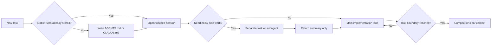

# Agent Engineering Playbook

## How to optimize AI agents and token usage in Codex and Claude Code

> A practical field guide for people who want coding agents to ship more, ask less, and waste fewer tokens.

This repository starts with one opinionated claim:

**Most token waste in agentic coding is not a pricing problem. It is a workflow design problem.**

Teams usually burn tokens for five boring reasons:

- They keep stale context alive for too long.
- They re-explain stable rules in chat instead of storing them in project memory.
- They use expensive parallelism on work that should have stayed serial.
- They let agents rediscover the environment every session.
- They write vague prompts that force broad scanning.

If you fix those five things, cost usually goes down while output quality goes up.

This README is the first post in a longer series. The next topics are listed in [ROADMAP.md](./ROADMAP.md).

## Why this repo exists

There is a lot of discussion about which coding agent is "better."

That is usually the wrong first question.

The first question should be:

**What workflow shape lets the agent spend tokens only on useful reasoning?**

That question matters more than brand loyalty.

OpenAI and Anthropic now expose enough of their agent design that we can stop treating token usage like a mystery. The public docs already reveal the real optimization levers:

- persistent project memory
- context compaction
- model routing
- prompt caching
- task decomposition
- isolated side contexts
- environment setup quality

Those levers are where the gains are.

## The mental model

Treat every agent session as a system with four budgets:

1. `Context budget`
2. `Turn budget`
3. `Parallelism budget`
4. `Model budget`

If any one of them grows without discipline, token usage balloons.

A useful heuristic is:

```text
effective token burn ~= active context × turns × parallel workers × model weight
```

That is not the billing formula. It is the operational reality.

The most expensive session is rarely the one with the priciest model.
It is usually the one with:

- too much irrelevant context
- too many clarification turns
- too many workers reading the same files
- too much instruction duplication

Context is compound interest.
Good context compounds speed.
Bad context compounds cost.

## One diagram



## Codex vs Claude Code in one table

| Problem | Codex | Claude Code | Optimization rule |
| --- | --- | --- | --- |
| Persistent repo memory | `AGENTS.md` is the durable instruction surface used to keep repo-specific context stable. | `CLAUDE.md` is the primary durable memory surface; Anthropic also documents importing `AGENTS.md` from it. | Stable rules belong in files, not repeated chat turns. |
| Long sessions | Codex supports conversation compaction, task queues, and Ask-first workflows. | Claude Code supports auto-compaction plus explicit `/compact`, `/clear`, and `/resume` workflows. | Split unrelated work and reset context aggressively. |
| Parallelism | Codex is designed around separate tasks and cloud execution. | Claude Code uses subagents with their own context windows. | Parallel work is a budget multiplier, not free speed. |
| Cost visibility | Codex optimization is mostly driven by task design, model choice, and cached input economics on the API side. | Claude Code explicitly exposes `/cost` and recommends status-line cost tracking. | Measure, then optimize. |
| Environment memory | Better setup scripts, env vars, and repo guidance reduce repeated failures. | Skills, hooks, and `CLAUDE.md` reduce repeated explanations and preprocessing load. | Move repeatable behavior out of the main conversation. |
| Model routing | Codex family models vary by capability and price; latest frontier Codex models target hard agentic coding tasks. | Anthropic explicitly recommends cheaper models for simpler work and stronger models for architecture-level reasoning. | Use frontier intelligence only where ambiguity justifies it. |

## 1. Persist the boring stuff

The highest-ROI optimization is also the least glamorous:

**stop retyping project rules into chat.**

OpenAI recommends using `AGENTS.md` to give Codex persistent repo context like naming conventions, business logic, quirks, and dependencies that the model cannot infer from code alone. OpenAI also says GPT-5-Codex adheres better to `AGENTS.md` instructions than earlier Codex variants.

Anthropic makes the same argument with a different file: `CLAUDE.md`. Their docs describe it as persistent project, user, or organization memory loaded into every session. They also explicitly recommend creating a `CLAUDE.md` that imports `AGENTS.md` if your repository already uses `AGENTS.md` for other coding agents.

This is the cross-tool pattern:

- shared coding standards go in the repo
- build, test, lint, and run commands go in the repo
- architecture constraints go in the repo
- naming conventions go in the repo
- fragile business rules go in the repo
- your current ticket details do **not** go in the repo

An example that keeps both tools aligned:

```md
@AGENTS.md

## Claude Code
- Use plan mode before changing billing code.
- Preserve public API behavior unless the task explicitly asks for a breaking change.
```

The rule is simple:

**If you explain the same thing twice, it probably belongs in project memory.**

## 2. Stop carrying unrelated context

Long-running sessions feel productive until they become context landfills.

This is where many teams quietly lose money.

OpenAI's Codex guidance strongly points toward an Ask-first workflow for larger changes. OpenAI also says Codex works best on well-scoped tasks and that prompts should look like GitHub issues, with concrete file paths, examples, and implementation anchors. On the product side, OpenAI has also added conversation compaction and a task queue to keep work moving without turning one thread into a junk drawer.

Anthropic is even more explicit. Claude Code's cost guide recommends:

- using `/cost` to monitor usage
- using `/clear` between unrelated tasks
- using `/compact` with preservation instructions
- using `/resume` when you actually need to come back later

That should become muscle memory.

My default operating rule is:

1. One session should cover one problem family.
2. If the problem changes, clear or switch threads.
3. If the session is long, compact before the context gets sloppy.
4. When compacting, tell the system what matters.

Example:

```text
/compact Preserve the current migration plan, touched files, failing tests, and unresolved edge cases.
```

That last line matters. Generic compaction is better than none, but targeted compaction is better than generic compaction.

## 3. Parallelism is a budget multiplier

Everybody loves the idea of "many agents working in parallel."

Very few teams price it honestly.

Parallelism is not a free productivity hack. It is a token amplification mechanism that only pays off when the work is genuinely separable.

Codex handles this with independent tasks and cloud execution. Claude Code handles it with subagents. Anthropic's subagent docs are unusually clear here: each subagent runs in its own context window with its own prompt and permissions, specifically to keep noisy side work from polluting the main conversation.

That is the right pattern.

Use separate contexts for:

- log archaeology
- code search dumps
- dependency research
- doc gathering
- one-off data cleanup
- large PR review summaries

Do **not** use separate contexts for:

- tiny edits in the same file cluster
- work that needs constant back-and-forth with the main plan
- tasks whose output is just one sentence you could have produced inline

Anthropic also documents a harder number that teams should internalize:

**agent teams can use roughly 7x more tokens than standard sessions when teammates run in plan mode.**

That is not an argument against delegation.
It is an argument for disciplined delegation.

The best pattern is:

- keep the main thread strategic
- send noisy side quests to isolated contexts
- bring back summaries, not raw transcripts

## 4. Environment quality is a token optimization feature

Teams often treat setup quality as a reliability issue.

It is also a cost issue.

OpenAI says better startup scripts, environment variables, and internet access configuration materially reduce Codex error rates. That means fewer dead-end turns, fewer repeated attempts, fewer "try again after setup changes" loops, and less wasted reasoning.

Anthropic says similar things from a different angle:

- offload processing to hooks and skills
- move instructions from `CLAUDE.md` to skills when they do not need to sit in every session
- use code intelligence plugins for typed languages

This is one of the most underused ideas in agent engineering:

**preprocess outside the main context whenever possible.**

Examples:

- parse giant logs with a hook, then pass the summary
- wrap repetitive workflows as a skill
- expose team scripts as tools instead of pasting shell recipes into chat
- move static docs into a skill or imported memory file instead of copying them per session

Anthropic explicitly notes that skills help because unlike always-loaded memory, the skill body loads only when used. That means long reference material can sit near the workflow without taxing every single prompt.

That is excellent context economics.

## 5. Right-size the model

A frontier model is a terrible default for low-ambiguity work.

Use the strongest model when the task has one or more of these traits:

- architecture uncertainty
- long-horizon refactors
- multi-step tool use
- unclear failure modes
- research plus implementation
- high review burden

Use a cheaper or smaller model when the task is mostly:

- pattern repetition
- boilerplate generation
- test expansion from obvious cases
- small localized edits
- format conversion
- low-risk cleanup

This is not theory. The product docs already point in this direction.

As of **April 17, 2026**, OpenAI describes `GPT-5.3-Codex` as its most capable agentic coding model. OpenAI's model docs list `GPT-5.3-Codex` at `$1.75` input / `$0.175` cached input / `$14.00` output per million tokens on the API side, while `GPT-5-Codex` is listed at `$1.25` / `$0.125` / `$10.00`. Both expose cached input pricing and 400K context windows.

Anthropic's Claude Code cost guide explicitly recommends:

- Sonnet for most coding tasks
- Opus for harder architecture or multi-step reasoning
- Haiku for simple subagent tasks

That is the right instinct across tools:

**pay for ambiguity, not for habit.**

## 6. Write prompts that reduce file reads

Prompt quality is not about sounding clever.
It is about shrinking search breadth.

Anthropic's cost guide says vague prompts like "improve this codebase" trigger broad scanning, while specific prompts like "add input validation to the login function in auth.ts" keep work efficient.

OpenAI says almost the same thing in different words: prompts should be structured like GitHub issues, with file paths, component names, example modules, and explicit intent.

Bad:

```text
Improve auth and make it production-ready.
```

Good:

```text
Add input validation to src/auth/login.ts.
Mirror the error handling style used in src/api/register.ts.
Do not change response shapes.
Add tests for empty password, malformed email, and locked account.
```

The second prompt does three important things:

- narrows the search space
- reduces clarification turns
- gives the agent a success shape

That is cheaper and better.

## 7. Optimize for cache hits, not just fewer words

A lot of "token optimization" advice stops at "write shorter prompts."

That is incomplete.

The real goal is to maximize **stable prefixes** and minimize **recomputation**.

OpenAI's Codex model docs list cached input pricing explicitly, which means stable repeated context is economically different from cold context on the API side.

Anthropic documents this even more directly through prompt caching:

- 5-minute cache writes cost `1.25x` base input
- 1-hour cache writes cost `2x` base input
- cache reads cost `0.1x` base input

Anthropic also says prompt caching works best when the reusable prefix stays stable. In practice that means:

- keep tool definitions stable
- keep system instructions stable
- put static repo context before fast-changing task context
- avoid reshuffling large prompt blocks every turn
- move durable instructions into memory files

For agentic coding, the winning layout is usually:

1. stable system behavior
2. stable repo instructions
3. stable tool affordances
4. current task
5. current diff, logs, or failures

The more of the top half stays unchanged, the more the economics improve.

## 8. Codex-specific moves that are worth stealing

OpenAI's public guidance around Codex adds a few very practical habits:

- Start large tasks in Ask mode before switching to code generation.
- Use `AGENTS.md` aggressively for repo-specific guidance.
- Improve the environment until the agent stops stumbling on setup.
- Use the task queue as a lightweight backlog for tangential fixes.
- Use Best-of-N when the problem has multiple reasonable implementations.

These are not just usability tricks.
They are token controls.

Why?

- Ask mode reduces expensive rework.
- `AGENTS.md` reduces repeated explanation.
- better environment setup reduces retries
- task queues stop one thread from carrying unrelated context
- Best-of-N is expensive in one dimension but can be cheaper than serial trial-and-error on ambiguous design work

OpenAI also notes that Codex can feel faster on small tasks and think longer on harder tasks, adapting its effort to task complexity. That is exactly what you want from a coding agent if your workflow gives it the right task boundaries.

## 9. Claude Code-specific moves that are worth stealing

Anthropic's Claude Code docs are especially strong on explicit cost hygiene.

The best ideas to steal immediately are:

- use `/cost` constantly
- clear between unrelated tasks
- compact with preservation instructions
- move bulky evergreen instructions into `CLAUDE.md`
- move infrequent workflows into skills
- use hooks for preprocessing
- route simple subtasks to smaller subagents
- treat agent teams as expensive by default

One more subtle but important pattern from Anthropic's docs:

`CLAUDE.md` is not the same thing as "put everything in one giant memory file."

Large always-loaded memory can become its own tax.
Their skills model is a better place for niche procedures, big references, and one-off operational playbooks because those load when needed instead of on every session.

That is exactly how mature teams should think about context tiers:

- always-loaded
- often-loaded
- on-demand

If everything is always-loaded, nothing is optimized.

## 10. Anti-patterns that quietly explode token bills

- One immortal chat thread for every task in the repo.
- Huge memory files full of old ticket details.
- Parallel agents reading the same files with overlapping scope.
- Using the strongest model for grep-level work.
- Pasting logs and docs instead of preprocessing them.
- Asking for "improvements" instead of naming the target file and expected outcome.
- Letting the agent rediscover build and test commands every session.
- Compaction without telling the system what must be preserved.
- Treating delegation as automatically faster.
- Optimizing prompt length while ignoring context shape.

## 11. My default playbook

If I had to give one operating checklist to a team using either Codex or Claude Code, it would be this:

1. Put durable repo rules into `AGENTS.md` or `CLAUDE.md`.
2. Keep one session focused on one problem family.
3. Start large changes with planning or Ask mode.
4. Delegate noisy side work to isolated contexts.
5. Bring back summaries, not raw search output.
6. Improve the environment until common setup mistakes disappear.
7. Use smaller models for narrow, low-ambiguity work.
8. Compact before context becomes garbage.
9. Clear hard at task boundaries.
10. Review and test before merge.

That playbook is not flashy.
It is how you make agents cheaper, calmer, and more reliable.

## 12. The bigger point

The future of agent engineering is not "better prompt tricks."

It is better **context architecture**.

The winning teams will not be the ones who merely buy the strongest models.
They will be the ones who know:

- what should persist
- what should reset
- what should delegate
- what should cache
- what should never enter the main context in the first place

That is how you turn coding agents from expensive demo machines into real operating leverage.

## What comes next

The next wave of posts in this repo will focus on the harder side of the problem:

- agent security
- prompt injection against tool-using agents
- secrets and environment isolation
- MCP risk boundaries
- sandbox design
- review policies for agent-generated changes

See the full list in [ROADMAP.md](./ROADMAP.md).

## Sources

These references were used to anchor product-specific claims in this post. Accessed on **April 17, 2026**.

- OpenAI: [Introducing GPT-5.3-Codex](https://openai.com/index/introducing-gpt-5-3-codex/)
- OpenAI: [GPT-5.3-Codex model page](https://developers.openai.com/api/docs/models/gpt-5.3-codex)
- OpenAI: [Introducing upgrades to Codex](https://openai.com/index/introducing-upgrades-to-codex/)
- OpenAI: [GPT-5-Codex model page](https://developers.openai.com/api/docs/models/gpt-5-codex)
- OpenAI: [Introducing GPT-5.2-Codex](https://openai.com/index/introducing-gpt-5-2-codex/)
- OpenAI: [How OpenAI uses Codex](https://openai.com/business/guides-and-resources/how-openai-uses-codex/)
- Anthropic: [Manage costs effectively in Claude Code](https://code.claude.com/docs/en/costs)
- Anthropic: [How Claude remembers your project](https://code.claude.com/docs/en/memory)
- Anthropic: [Create custom subagents](https://code.claude.com/docs/en/sub-agents)
- Anthropic: [Extend Claude with skills](https://code.claude.com/docs/en/skills)
- Anthropic: [Prompt caching](https://platform.claude.com/docs/en/build-with-claude/prompt-caching)
